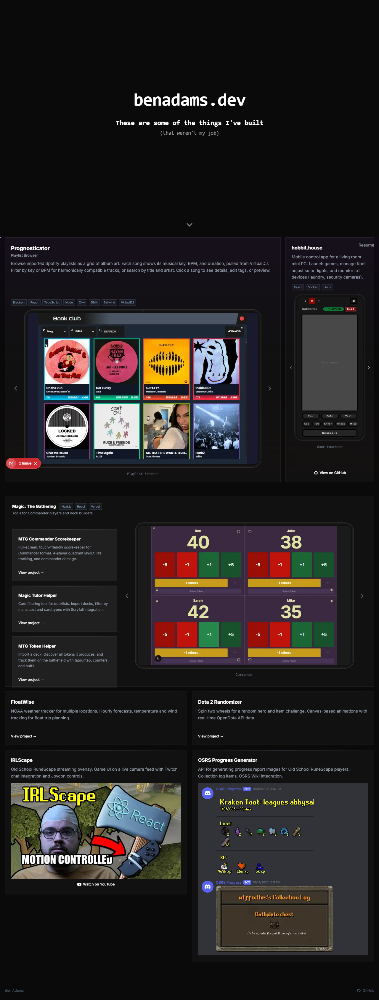
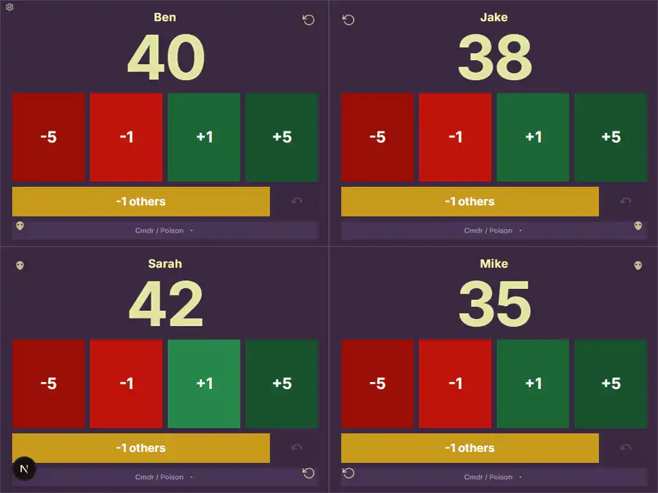
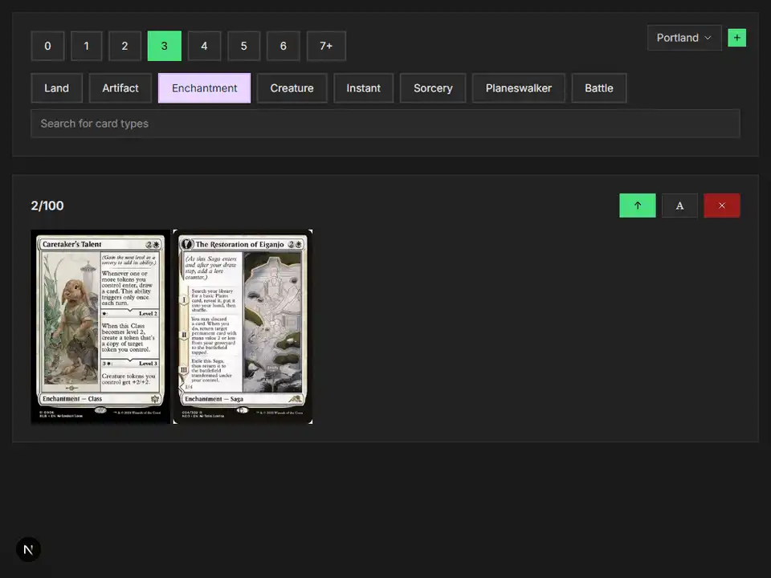
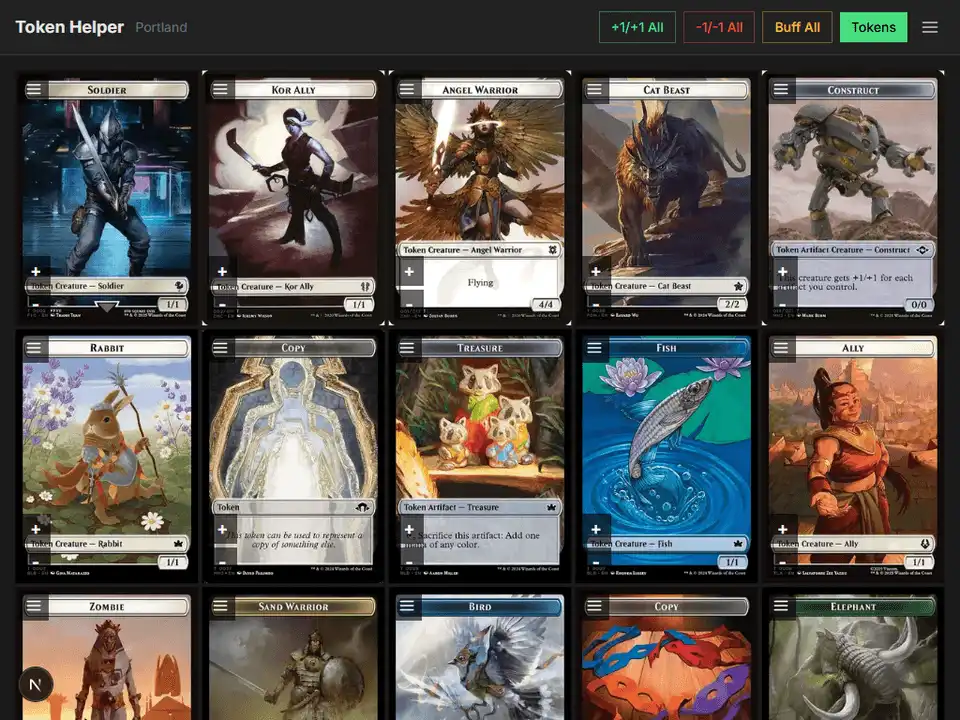
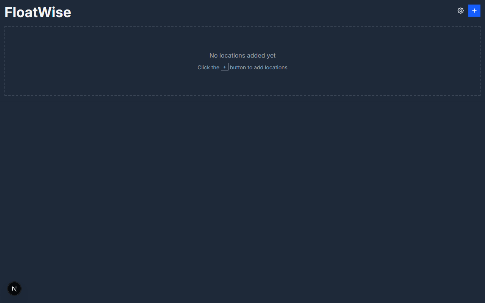
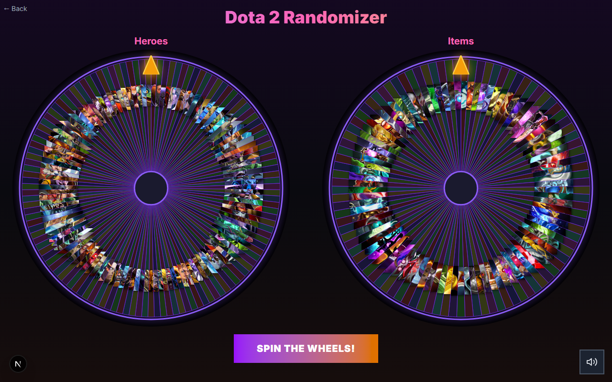
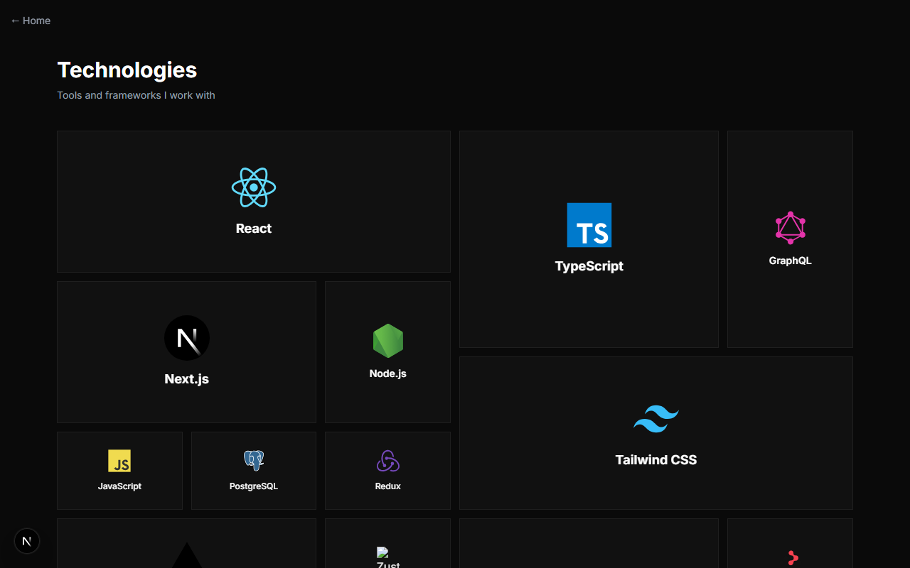

# benadams.dev

Personal homepage and collection of web tools built with Next.js 16, React 19, TypeScript, and Tailwind CSS.



## Apps

### MTG Commander Life Tracker

> `/commander`

Full-screen, touch-friendly scorekeeper for Commander format. 4-player quadrant layout with life tracking, commander damage, poison counters, and undo history. State persists in localStorage.



### Magic Tutor Helper

> `/tutor-helper`

Card filtering tool for Commander decklists. Import decks from Archidekt, filter by mana cost and card type with Scryfall API integration. Save multiple decks with localStorage persistence.



### MTG Token Helper

> `/token-helper`

Import a deck to discover all tokens it produces via Scryfall. Track tokens on the battlefield with tap/untap, +1/+1 counters, and power/toughness buffs.



### FloatWise

> `/floatwise`

NOAA weather tracker for planning float trips. Add multiple locations, view hourly forecasts with temperature and wind data. Shareable via URL-encoded location parameters.



### Dota 2 Randomizer

> `/dota-randomizer`

Spin two canvas-based wheels for a random hero and item challenge. Pulls hero and item data from the OpenDota API with sound effects and confetti.



### Resume

> `/resume`

Interactive resume with a technology bento grid featuring ambient glow effects and mouse-tracking interactions.



## Also Featured on the Homepage

These are external projects showcased in the homepage bento grid:

- **Prognosticator** -- Electron app for DJ set management with VirtualDJ integration, DMX lighting control, and beat-synced OBS scene switching
- **hobbit.house** -- Mobile control app for a living room mini PC ([GitHub](https://github.com/BigFancyBen/hobbit-ccp))
- **IRLScape** -- Old School RuneScape streaming overlay with Twitch chat integration ([YouTube](https://www.youtube.com/watch?v=gCofVhR5HUQ))
- **OSRS Progress Generator** -- Discord bot API for generating OSRS progress report images

## Tech Stack

- **Framework:** Next.js 16 (App Router, Turbopack)
- **UI:** React 19, Tailwind CSS 4
- **Language:** TypeScript 5
- **Animation:** Motion (Framer Motion)
- **Testing:** Playwright e2e
- **Realtime:** Ably (Commander multiplayer)
- **APIs:** Scryfall, NOAA, OpenStreetMap Nominatim, OpenDota
- **Hosting:** Vercel

## Development

```bash
npm install          # Install dependencies (Node >= 22 required)
npm run dev          # Start dev server with Turbopack
npm run build        # Production build
npm run lint         # ESLint
npm run type-check   # TypeScript check
npm test             # Playwright e2e tests
```
