<h1 align="center">benadams.dev</h1>

<p align="center">
  <b>The things I've built that weren't my job.</b><br>
  A multiplayer rafting game, a DJ and lighting rig, two Discord games my friends play every day, and a handful of tools I use every week.
</p>

<p align="center">
  <a href="https://benadams.dev"><b>benadams.dev</b></a> ·
  <a href="https://benadams.dev/resume">Technologies</a> ·
  <a href="https://bigfancyben.itch.io/middle-fork-rafting-simulator">itch.io</a> ·
  <a href="https://github.com/BigFancyBen">GitHub</a>
</p>

<p align="center">
  <a href="https://benadams.dev">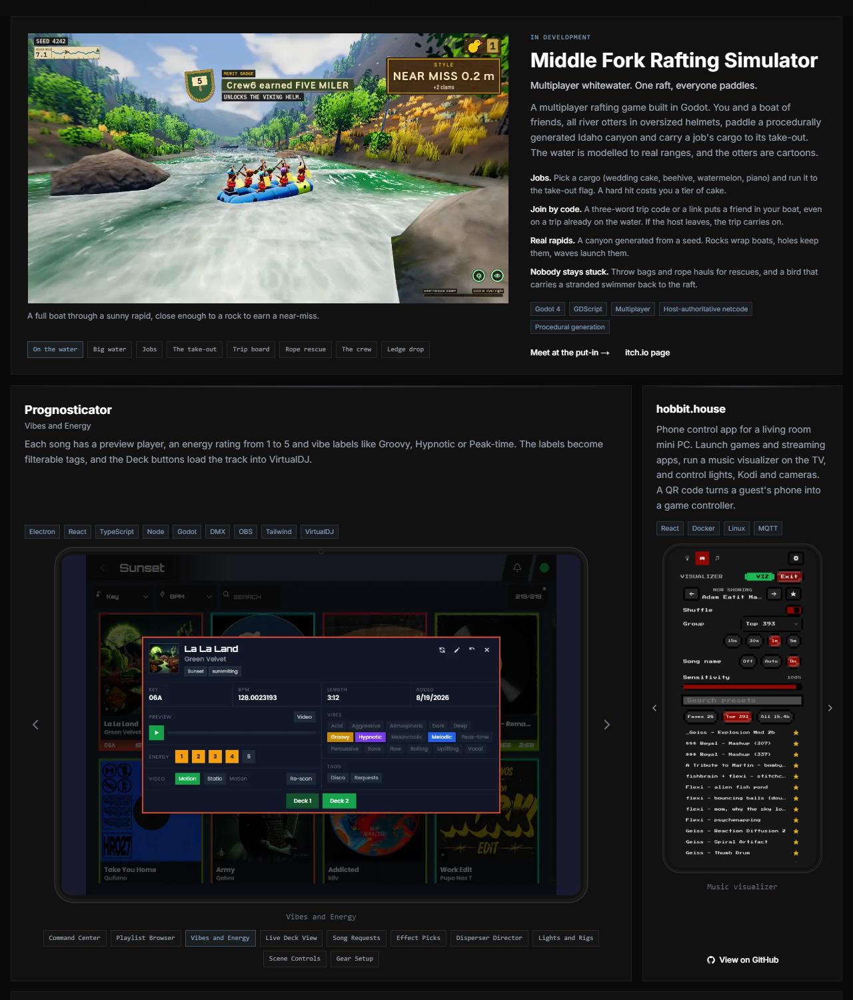</a>
</p>

I'm Ben Adams. This repository is my portfolio site, and it is also where several of the projects on it live: the web apps are routes in this Next.js app, and the two Discord bots are Cloudflare Workers in this repo that use the site to draw their images. The larger projects (the game, the DJ software, the home hub) have their own repositories and are shown here with screenshots.

## Projects

| Project | What it is | Built with |
| --- | --- | --- |
| [Middle Fork Rafting Simulator](#middle-fork-rafting-simulator) | Multiplayer whitewater rafting game, in development | Godot 4, GDScript, host-authoritative netcode |
| [Prognosticator](#prognosticator) | DJ library, beat-synced DMX lighting and OBS scenes, with a 3D visualizer | Electron, React, TypeScript, Godot 4, C |
| [hobbit.house](#hobbithouse) | Phone remote for a living room PC, lights and media | React, Docker, Linux, MQTT |
| [Scrandle and Scranbot](#scrandle-and-scranbot) | A daily food photo game for a Discord channel, and its weekly web puzzle | Cloudflare Workers, D1, R2, Next.js |
| [Yut Hut](#yut-hut) | Workout check-ins that play out as Old School RuneScape progress | Cloudflare Workers, D1, R2, Next.js |
| [Magic: The Gathering tools](#magic-the-gathering-tools) | Life tracker, tutor filter and token tracker for Commander | Next.js, React, Scryfall |
| [FloatWise](#floatwise) | Float trip planner with forecasts, live river flow and a map | Next.js, Leaflet, Open-Meteo, USGS |
| [Dota 2 Randomizer](#dota-2-randomizer) | Two wheels that pick a hero and an item | Next.js, Canvas, OpenDota |
| [IRLScape](#irlscape) | RuneScape interface over a live camera feed | Twitch chat, Joy-Con input |
| [OSRS Progress Generator](#osrs-progress-generator) | API that draws RuneScape progress cards for a Discord bot | Node, OSRS Wiki |

---

## Middle Fork Rafting Simulator

**In development** · [benadams.dev/river](https://benadams.dev/river) · [itch.io page](https://bigfancyben.itch.io/middle-fork-rafting-simulator)

Multiplayer whitewater: one raft, and everyone paddles. You and a boat of friends, all river otters in oversized helmets, run a procedurally generated Idaho canyon and carry a job's cargo to its take-out. The water is modelled to real ranges, and the otters are cartoons.

<p align="center">
  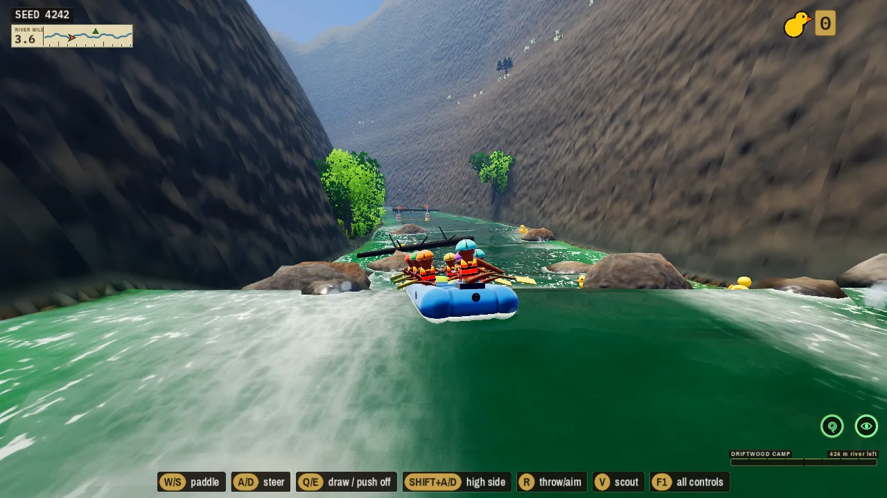
</p>

<table>
  <tr>
    <td width="33%">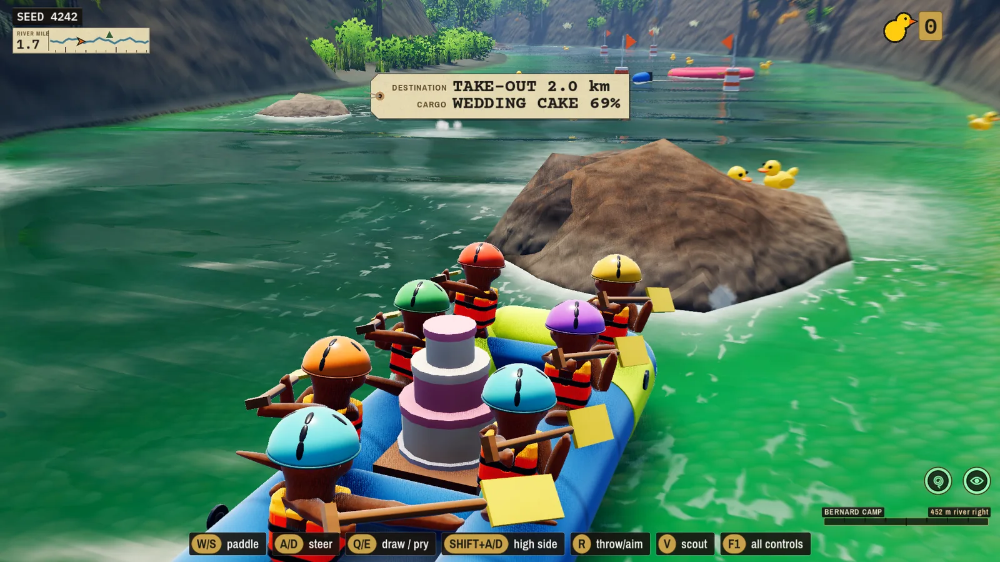</td>
    <td width="33%">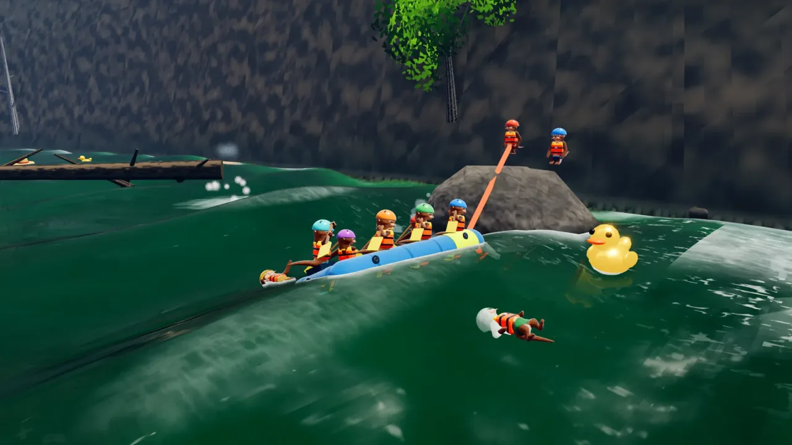</td>
    <td width="33%">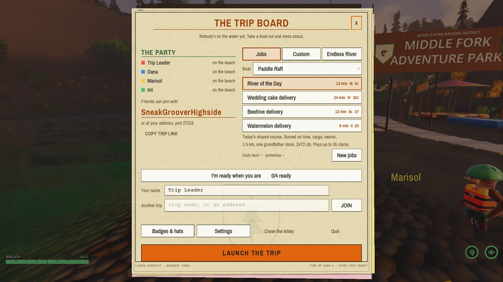</td>
  </tr>
  <tr>
    <td valign="top"><b>Jobs.</b> Pick a cargo (wedding cake, beehive, watermelon, piano) and run it to the take-out flag. A hard hit costs you a tier of cake.</td>
    <td valign="top"><b>Rescues.</b> Rocks wrap boats, holes keep them, waves launch them. Throw bags and rope hauls get everyone back in.</td>
    <td valign="top"><b>Join by code.</b> A three-word trip code or a link puts a friend in your boat, even on a trip already on the water.</td>
  </tr>
</table>

- The canyon is generated from a seed.
- Netcode is host-authoritative, and if the host leaves, the trip carries on.
- The web side is in this repo: [`/river`](app/river) is the game's landing page, and a `benadams.dev/river/join/<code>` link hands a trip code to an installed copy of the game.

**Stack:** Godot 4, GDScript, host-authoritative multiplayer, procedural generation

---

## Prognosticator

A desktop app that runs a DJ set end to end. It imports Spotify playlists, reads BPM and key from VirtualDJ, suggests tracks that mix harmonically, and drives DMX lights and OBS scenes on the beat.

<table>
  <tr>
    <td width="50%">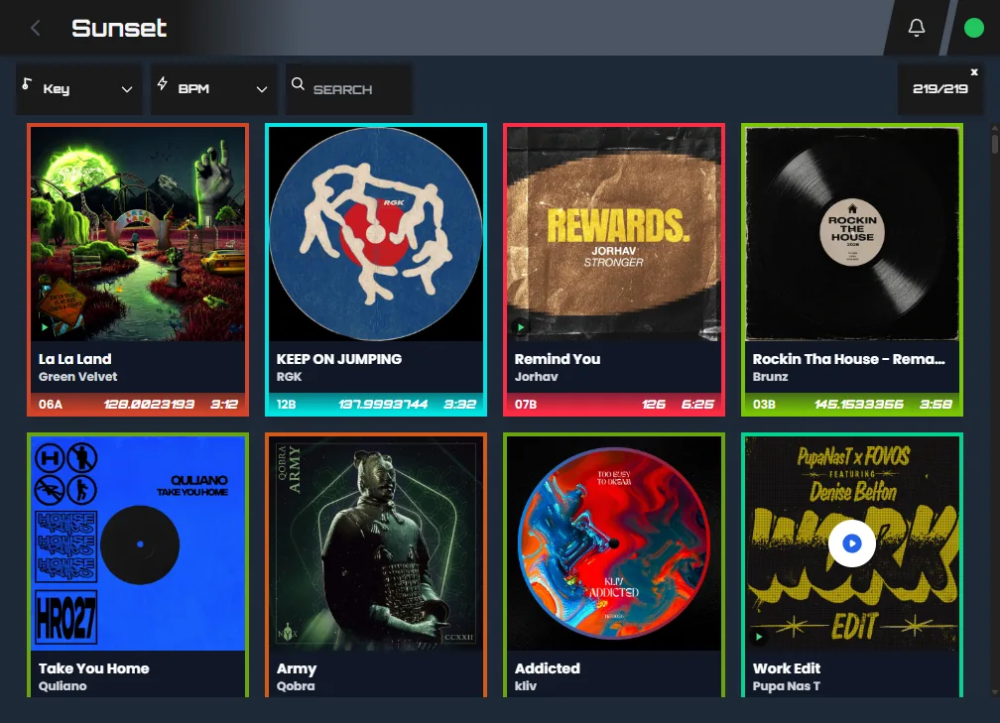</td>
    <td width="50%">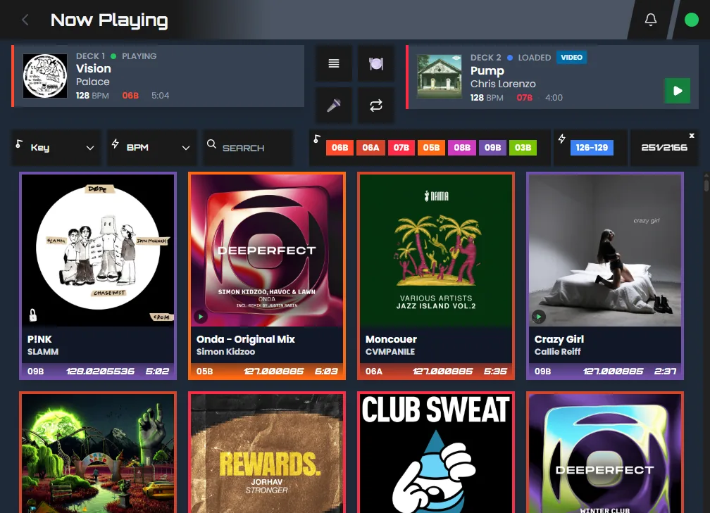</td>
  </tr>
  <tr>
    <td valign="top"><b>Playlist browser.</b> Imported playlists show as album art with Camelot key, BPM and length on every card, colored by key.</td>
    <td valign="top"><b>Live deck view.</b> Click a deck and the library filters to tracks that are harmonically compatible and within BPM range. Auto mix runs beat-synced crossfades of 16 to 128 beats.</td>
  </tr>
  <tr>
    <td>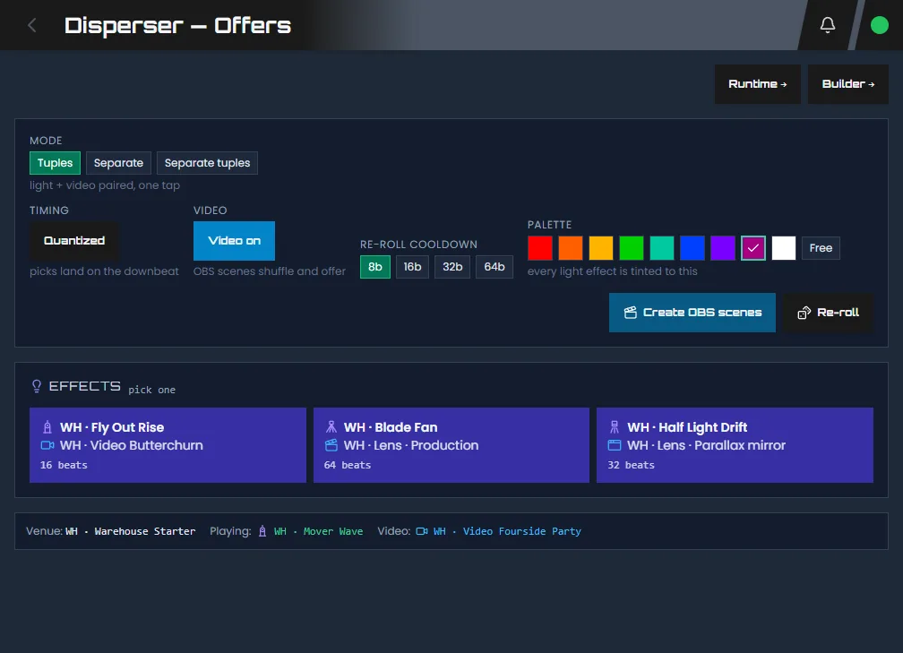</td>
    <td>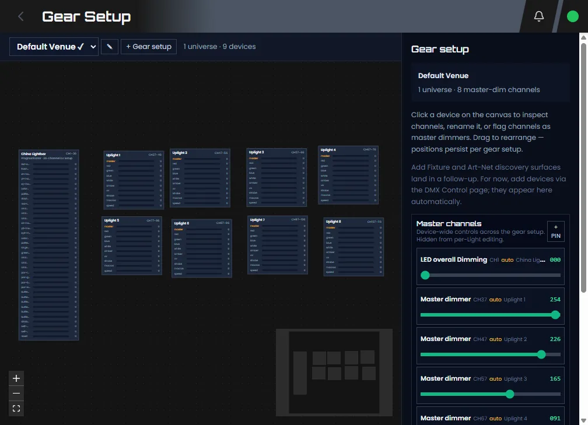</td>
  </tr>
  <tr>
    <td valign="top"><b>Effect Picks.</b> Instead of a wall of pads, the board deals three cards, each pairing a light effect with a video look. Tap one and it fires on the next downbeat.</td>
    <td valign="top"><b>Gear setup.</b> Every DMX device with named channels, from a library of 2000+ OpenFixtureLibrary definitions. With no interface plugged in, a virtual universe keeps the lighting working on screen.</td>
  </tr>
</table>

- Rigs are built from a catalog of 87 actions and 122 group animations, aimed at named lights instead of raw DMX channels.
- Light and scene changes are quantized to the bar or phrase, with beat timing from VirtualDJ.
- Song requests take a YouTube or Spotify link, and a Spotify request streams straight through VirtualDJ without waiting for a download.

**Stack:** Electron, React, TypeScript, Node, Tailwind, DMX, OBS, VirtualDJ

### The visualizer

Prognosticator sends its beat grid and DMX output to a Godot visualizer, so every light cue also plays in a venue that does not exist.

<table>
  <tr>
    <td width="50%">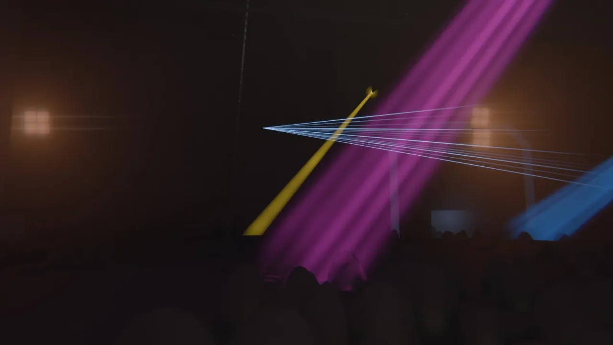</td>
    <td width="50%">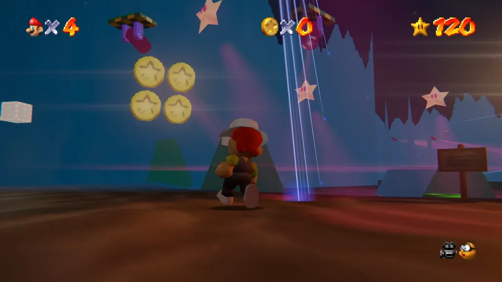</td>
  </tr>
  <tr>
    <td valign="top"><b>Warehouse.</b> An endless, procedurally generated club built out of code and lit only with DMX values. The rig that drives the real fixtures drives its 104 virtual ones as volumetric beams in haze, while a camera rides through rooms and cuts on the beat.</td>
    <td valign="top"><b>Super Mario 64.</b> The same DMX kit re-skinned onto the game: pars are Power Stars, movers are cannon heads, and the lava is eight pars. The open-source decomp port runs as a library inside Godot. All 45 areas have a lighting plot, and an autopilot plays Mario on the beat.</td>
  </tr>
  <tr>
    <td>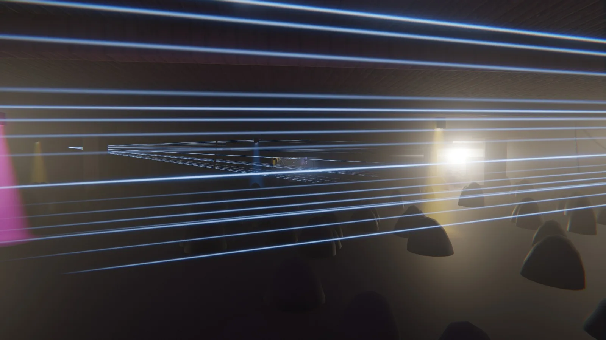</td>
    <td>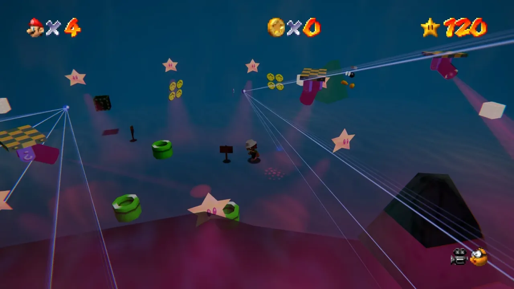</td>
  </tr>
</table>

**Stack:** Godot 4, GDScript, GDExtension, C, Spout

---

## hobbit.house

A phone control app for a living room mini PC. It launches games and streaming apps, runs a music visualizer on the TV, and controls lights, Kodi and cameras. A QR code turns a guest's phone into a game controller.

<p align="center">
  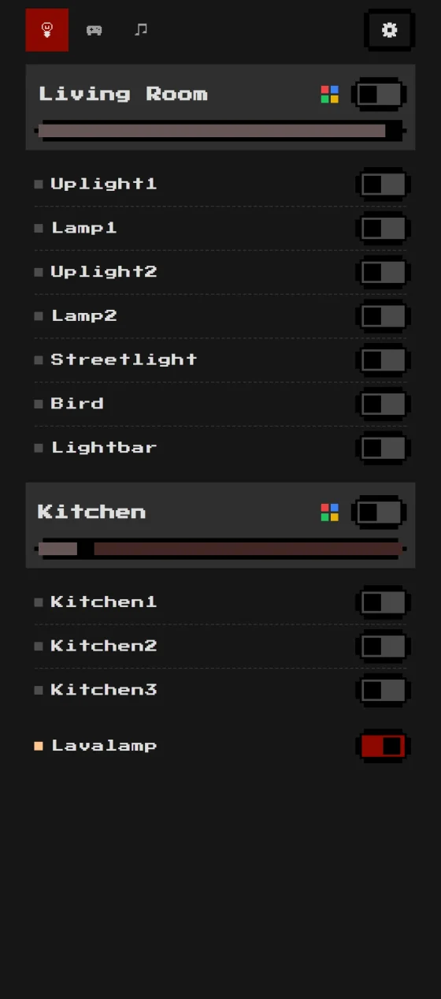
  
  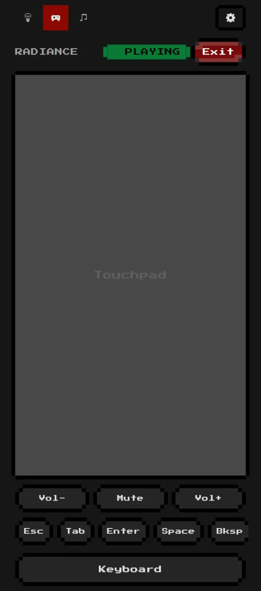
  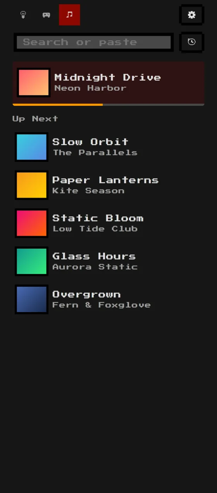
</p>

**Stack:** React, Docker, Linux, MQTT

---

## Scrandle and Scranbot

**Play the weekly puzzle:** [benadams.dev/scrandle/play](https://benadams.dev/scrandle/play) · **Code:** [`scrandle-worker/`](scrandle-worker), [`app/scrandle/`](app/scrandle), [`app/api/scrandle/`](app/api/scrandle)

A game built from my friends' dinner photos. Scranbot posts a food photo matchup in our Discord channel every day, keeps votes private until the round closes, then reveals the result. Each week it draws ten pairs for Scrandle, a web puzzle where you pick the plate the channel rated higher.

<table>
  <tr>
    <td width="50%">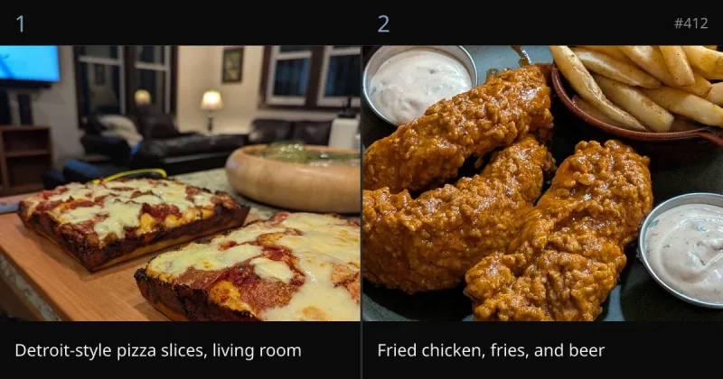</td>
    <td width="50%">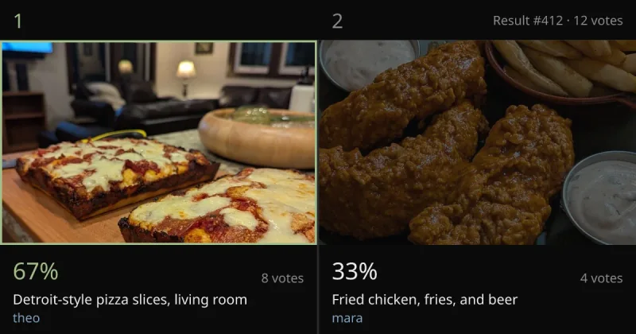</td>
  </tr>
  <tr>
    <td valign="top"><b>The daily matchup</b>, posted to Discord with a button for each plate.</td>
    <td valign="top"><b>The result</b>, a day later, with vote shares and who cooked what.</td>
  </tr>
  <tr>
    <td>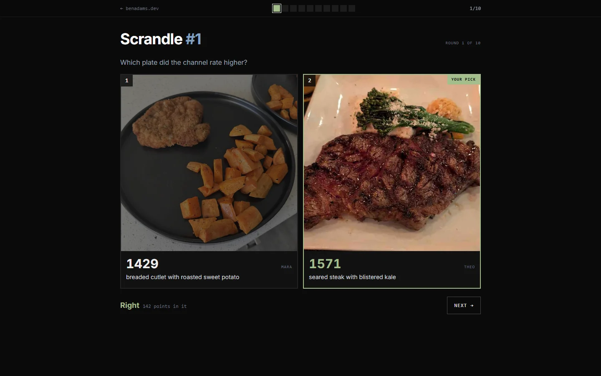</td>
    <td>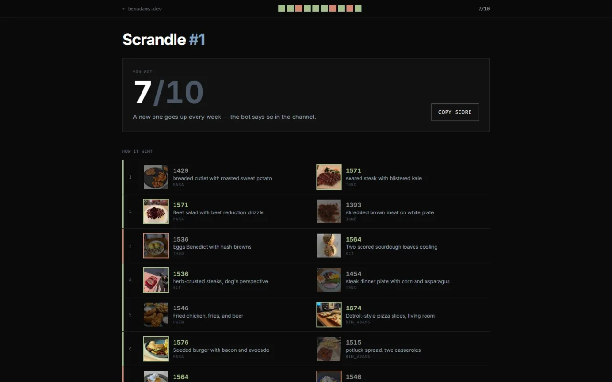</td>
  </tr>
  <tr>
    <td valign="top"><b>Scrandle on the web.</b> Ten rounds a week. Each reveal shows both ratings and how many points were in it.</td>
    <td valign="top"><b>Your score</b>, ready to copy back into the channel.</td>
  </tr>
</table>

- The whole game is one Cloudflare Worker on an hourly cron, with a D1 database and photos in R2.
- Ratings are Glicko, not plain Elo. A photo nobody has voted on moves a long way on its first result, and one with a history barely moves.
- Workers on the free plan get 10ms of CPU per request, which cannot rasterize an image. So the Worker signs a URL, this Next.js app renders the card, and the Worker uploads the PNG to Discord.
- Besides pairs, the bot runs five-photo ranking rounds on a theme (five pastas, five beers) and a weekend caption contest.

**Stack:** Cloudflare Workers, D1, R2, Discord interactions, Next.js, TypeScript

---

## Yut Hut

**Read the rules:** [benadams.dev/yut-hut](https://benadams.dev/yut-hut) · **Code:** [`yut-worker/`](yut-worker), [`app/yut-hut/`](app/yut-hut), [`app/api/yut/`](app/api/yut)

A Discord bot that turns workout check-ins into Old School RuneScape progress for a friend group. Each check-in is a Slayer session run on the game's real XP table and drop tables, and the results come back as OSRS-style cards.

<table>
  <tr>
    <td width="42%"></td>
    <td width="58%">
      
      
    </td>
  </tr>
  <tr>
    <td valign="top"><b>A check-in.</b> Kills, drops, XP and level-ups from one session.</td>
    <td valign="top"><b>The character sheet and a level-up</b>, both drawn by this site's image routes.</td>
  </tr>
</table>

- **Two a week is the whole game.** The first two check-ins count in full, then half, then a fifth. A rest day is written down and never punished.
- **The bot asks.** Every morning it posts one question with a Yes and a No, and edits the roll call into the post as people answer.
- **Numbers from the wiki.** Monsters, Slayer masters, drop rates and gear come from the OSRS Wiki. Only the session length is tuned, so that two check-ins a week reaches Dragon armour in week 52.
- **Something to chase.** Clue caskets, a pick of three spoils, gear drops, an Achievement Diary, a quest and a group boss each week.
- The balance is checked by a script that simulates a full year of play.

**Stack:** Cloudflare Workers, D1, R2, Discord interactions, Next.js, TypeScript

---

## Magic: The Gathering tools

Three tools I use at the table for Commander. All of them keep their state in the browser.

<table>
  <tr>
    <td width="33%"><a href="https://benadams.dev/commander">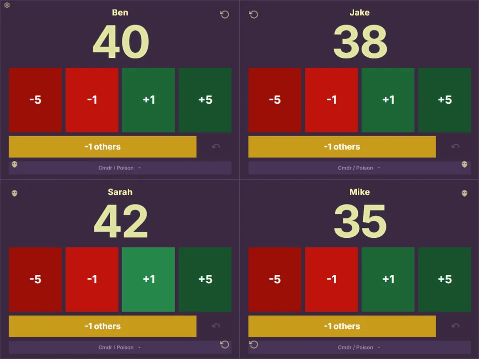</a></td>
    <td width="33%"><a href="https://benadams.dev/tutor-helper"></a></td>
    <td width="33%"><a href="https://benadams.dev/token-helper"></a></td>
  </tr>
  <tr>
    <td valign="top"><b><a href="https://benadams.dev/commander">Commander Scorekeeper</a>.</b> Full-screen, touch-friendly life tracker. Four-player quadrants with life, poison, commander damage and undo history.</td>
    <td valign="top"><b><a href="https://benadams.dev/tutor-helper">Tutor Helper</a>.</b> Import a decklist from Archidekt and filter it by mana cost and card type, to see what a tutor can fetch.</td>
    <td valign="top"><b><a href="https://benadams.dev/token-helper">Token Helper</a>.</b> Import a deck and it finds every token the deck can make. Track them with tap/untap, counters and buffs.</td>
  </tr>
</table>

**Stack:** Next.js, React, TypeScript, Scryfall API · **Code:** [`app/commander/`](app/commander), [`app/tutor-helper/`](app/tutor-helper), [`app/token-helper/`](app/token-helper)

---

## FloatWise

**Try it:** [benadams.dev/floatwise](https://benadams.dev/floatwise) · **Code:** [`app/floatwise/`](app/floatwise)

A float trip planner. Hourly forecast tables for several locations side by side, the live Yellowstone River flow, and a map for pinning put-ins, take-outs and swim spots. A trip's locations are encoded in the URL, so a plan can be shared as a link.

<p align="center">
  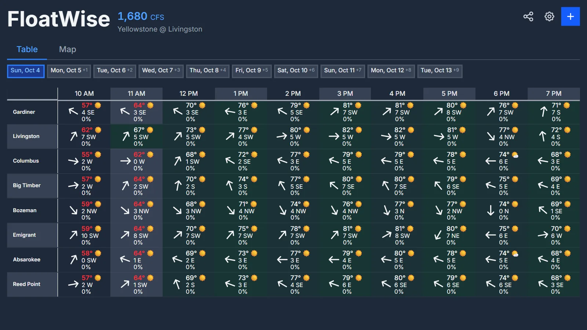
</p>

**Stack:** Next.js, Leaflet, Open-Meteo, USGS

---

## Dota 2 Randomizer

**Try it:** [benadams.dev/dota-randomizer](https://benadams.dev/dota-randomizer) · **Code:** [`app/dota-randomizer/`](app/dota-randomizer)

Spin two wheels to get a random hero and a random item to build. The wheels are drawn on canvas and fed by live OpenDota data, with sound and confetti.

<p align="center">
  
</p>

**Stack:** Next.js, Canvas, OpenDota

---

## IRLScape

**Watch:** [the video on YouTube](https://www.youtube.com/watch?v=gCofVhR5HUQ)

An Old School RuneScape streaming overlay. It puts the game's interface on a live camera feed, with Twitch chat integration and Joy-Con controls.

<p align="center">
  <a href="https://www.youtube.com/watch?v=gCofVhR5HUQ">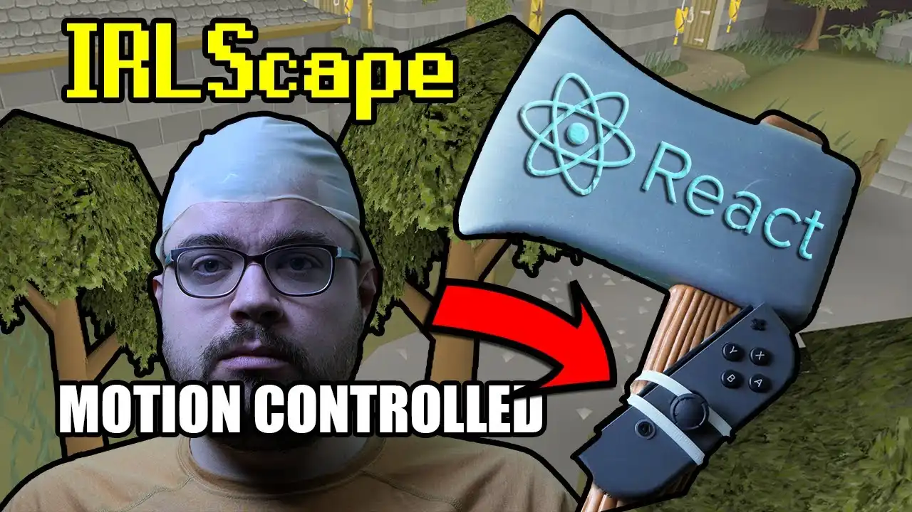</a>
</p>

---

## OSRS Progress Generator

An API that draws progress report images for Old School RuneScape players, with loot, XP and collection log items looked up on the OSRS Wiki. A Discord bot posts the results.

<p align="center">
  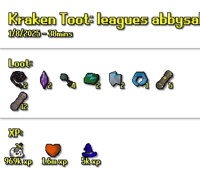
  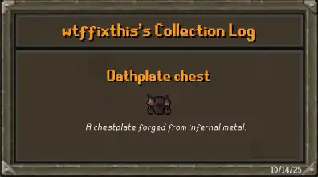
</p>

---

## How this repo is built

| Part | Details |
| --- | --- |
| Site | Next.js 16 (App Router, Turbopack), React 19, TypeScript, Tailwind CSS 4, Motion for animation. Hosted on Vercel. |
| Bots | Two Cloudflare Workers ([`scrandle-worker/`](scrandle-worker), [`yut-worker/`](yut-worker)), each with a D1 database, an R2 bucket and an hourly cron. |
| Image rendering | Signed routes under [`app/api/`](app/api) draw the bots' cards as PNGs, because a free-plan Worker has no CPU budget for it. |
| Testing | Playwright end-to-end tests for the site. The Workers have simulation scripts that play rounds, and a whole year of check-ins, against a mock Discord. |
| CI and deploys | GitHub Actions lints, type-checks and builds every pull request, and deploys each Worker when its folder changes. |
| Data | Scryfall, Archidekt, Open-Meteo, USGS, OpenDota and the OSRS Wiki. The web apps keep user state in localStorage. |

<details>
<summary>Running it locally</summary>

Requires Node 22 or newer.

```bash
npm install          # Install dependencies
npm run dev          # Dev server at http://localhost:3000
npm run build        # Production build
npm run lint         # ESLint
npm run type-check   # TypeScript
npm test             # Playwright end-to-end tests
npm run screenshots  # Recapture the README screenshot (needs the dev server running)
```

Each Worker has its own README with setup and deploy steps.

</details>
